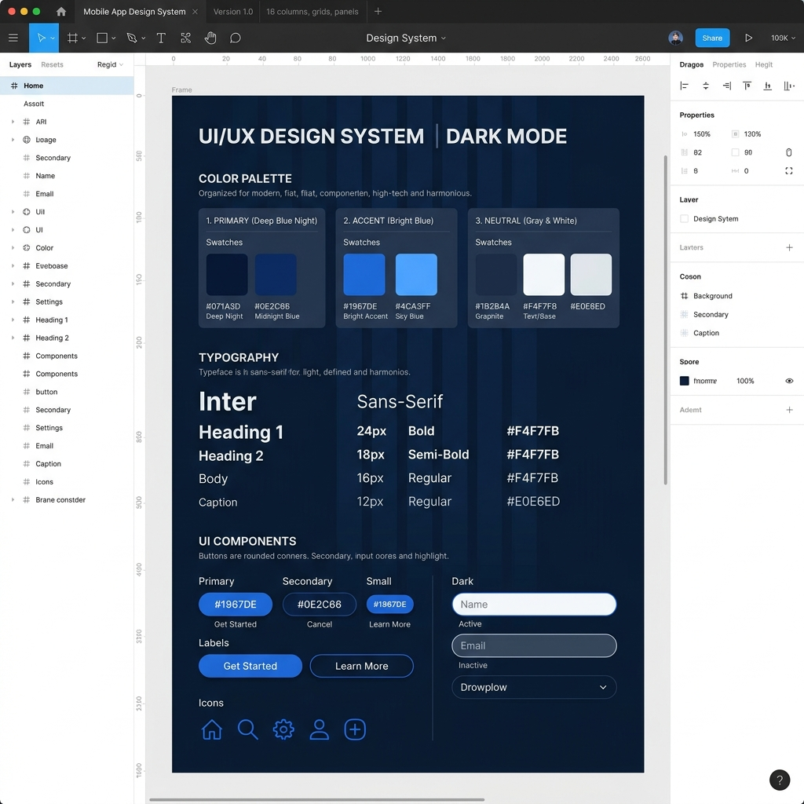
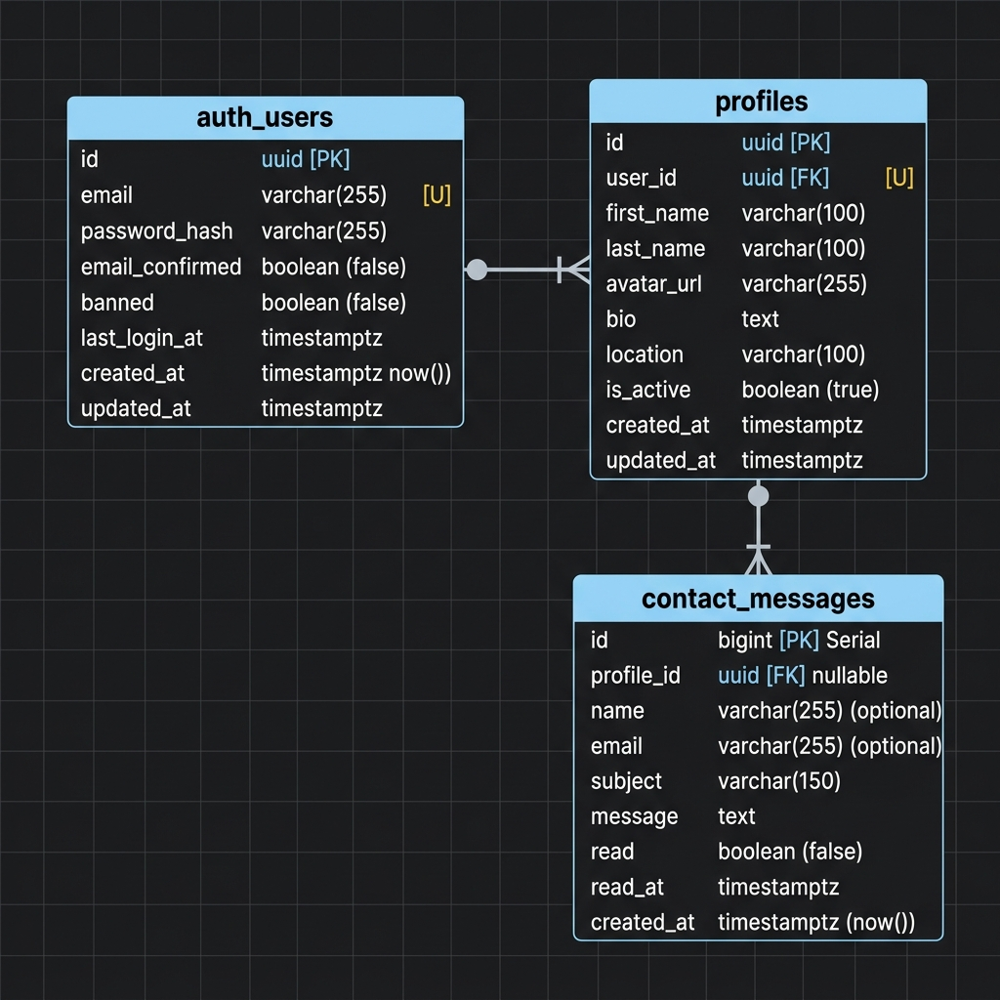
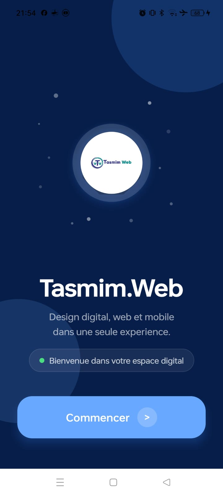
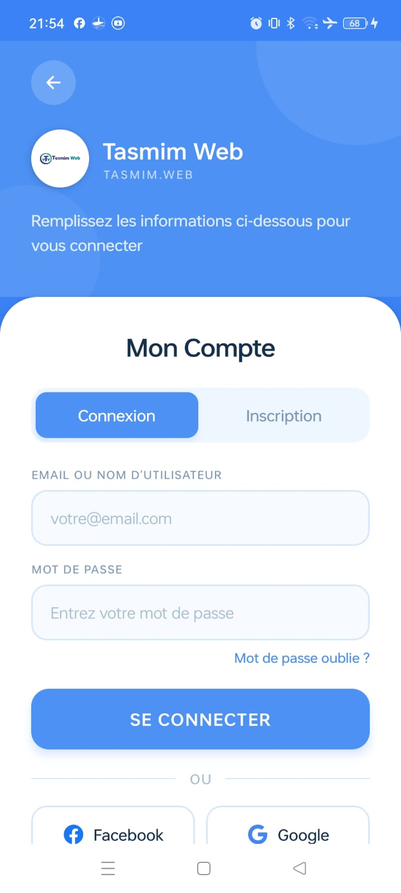
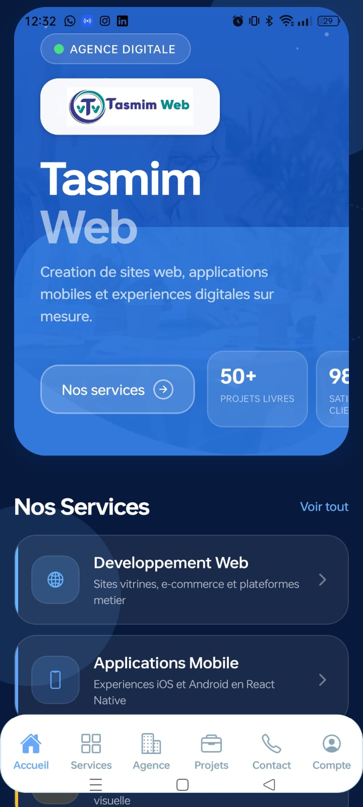
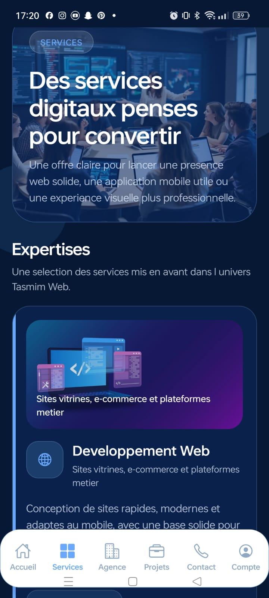
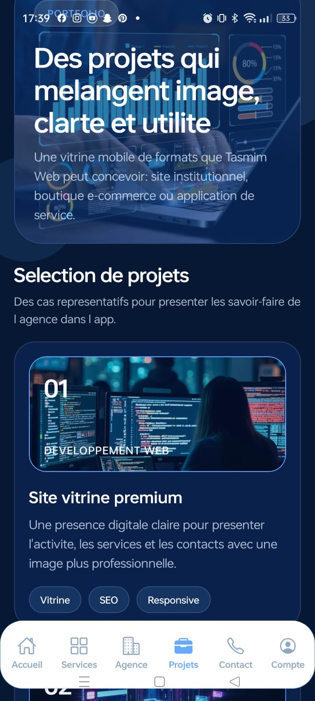
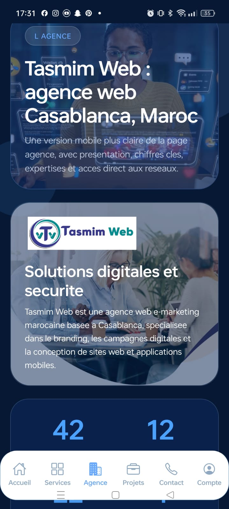
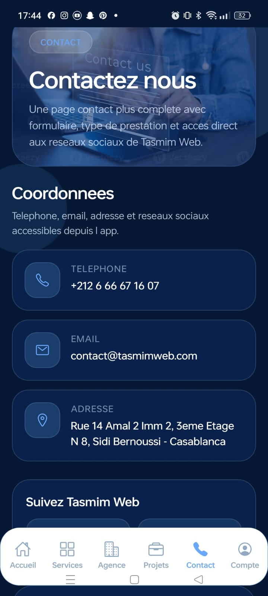
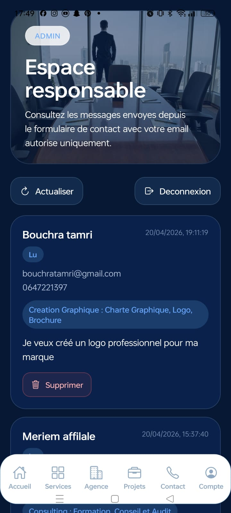

# Tasmim App 📱✨

[](https://expo.dev/preview)
[](https://expo.dev)
[](https://reactnative.dev)
[](https://www.typescriptlang.org)
[](https://supabase.com)
[](https://www.postgresql.org)

**Tasmim App** est l'application mobile officielle de l'agence digitale **Tasmim Web**. Développée avec **React Native**, **Expo** et **Supabase**, cette application permet d'exposer de manière immersive et moderne les services et projets de l'agence, tout en offrant un canal direct de contact client et une console d'administration sécurisée en temps réel pour le responsable.

---

## 🎨 Aperçu Visuel de l'Application

L'interface a été conçue selon une esthétique sombre haut de gamme (**Dark Mode**), caractérisée par des contrastes soignés et des micro-animations interactives pour une navigation moderne.

### 📐 Charte Graphique et Design System
Voici le système de design et la palette chromatique développés sur Figma et intégrés dans l'application :



### 📊 Schéma Physique de la Base de Données (PostgreSQL)
Le schéma relationnel ci-dessous illustre l'organisation et l'intégrité référentielle des données sécurisées par RLS au niveau de Supabase :



### 📱 Principaux Écrans de l'Application :
L'application comporte six rubriques clés et un espace d'administration sécurisé :

| Écran de Bienvenue | Écran d'Authentification |
| :---: | :---: |
|  |  |

| Accueil / Dashboard | Catalogue des Services |
| :---: | :---: |
|  |  |

| Portfolio des Projets | Présentation de l'Agence |
| :---: | :---: |
|  |  |

| Formulaire de Contact | Espace Responsable (Admin) |
| :---: | :---: |
|  |  |

---

## 🛠️ Prérequis Techniques

Pour exécuter ou compiler le projet localement, assurez-vous de disposer des éléments matériels et logiciels suivants :

* **Node.js** : Version **>= 18.x** (la version LTS v20.x ou ultérieure est recommandée).
* **Package Manager** : `npm` (installé par défaut avec Node.js) ou `yarn`.
* **Expo CLI** : Intégré automatiquement via `npx expo` (il n'est plus nécessaire de l'installer globalement).
* **EAS CLI** (pour la compilation cloud) : Installé globalement via `npm install -g eas-cli`.
* **Expo Go** (sur smartphone Android ou iOS) : Pour tester l'application en direct en scannant le code QR généré.
* **Émulateur** : Android Studio Emulator ou Xcode Simulator (optionnel si vous testez sur un appareil physique).

---

## 🚀 Démarrage Rapide

### 1. Cloner le dépôt
```bash
git clone <url-du-depot-github>
cdasmimApp
```

### 2. Installer les dépendances
```bash
npm install
```

### 3. Configurer les variables d'environnement
Créez un fichier `.env` à la racine du projet en vous basant sur le fichier `.env.example` et renseignez vos clés de connexion Supabase :
```env
EXPO_PUBLIC_SUPABASE_URL=https://votre-projet.supabase.co
EXPO_PUBLIC_SUPABASE_PUBLISHABLE_KEY=votre-cle-publique-anon
EXPO_PUBLIC_ADMIN_EMAIL=najileila308@gmail.com
```

### 4. Démarrer le serveur de développement Expo
```bash
npx expo start
```
* Appuyez sur **`a`** pour ouvrir sur un émulateur Android.
* Appuyez sur **`i`** pour ouvrir sur un émulateur iOS.
* Scannez le **Code QR** affiché dans le terminal avec l'application **Expo Go** sur votre smartphone pour tester en direct.

---

## 📦 Compilation et Build de l'APK (Android)

Pour compiler et générer le fichier d'installation final APK sans avoir besoin d'installer Android Studio localement, le projet utilise les services cloud **EAS Build** :

1. **Se connecter à votre compte Expo** :
   ```bash
   eas login
   ```
2. **Lancer le build de preview (APK)** :
   ```bash
   eas build --platform android --profile preview
   ```
3. Une fois le build cloud terminé, téléchargez l'APK généré via le lien ou scannez le code QR de téléchargement fourni par l'outil CLI d'Expo.
