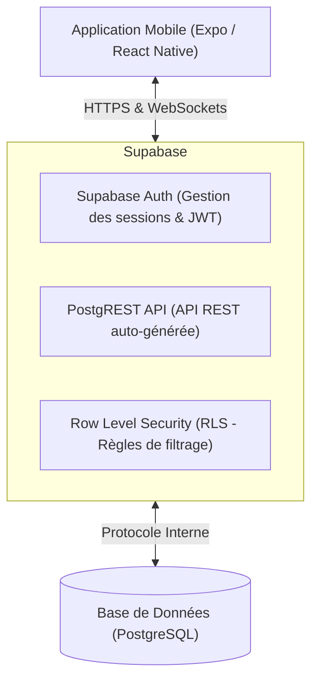
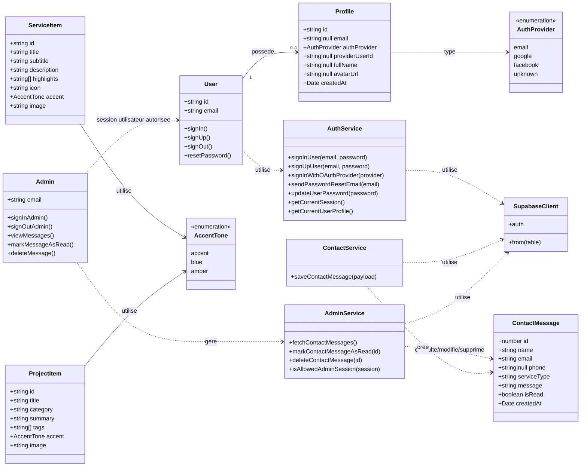
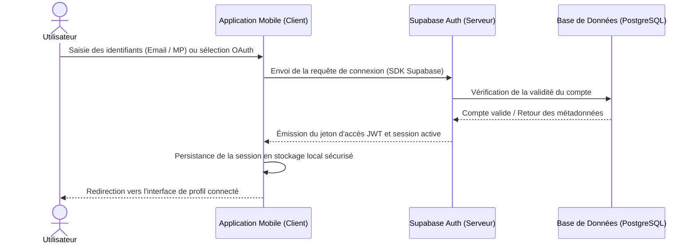
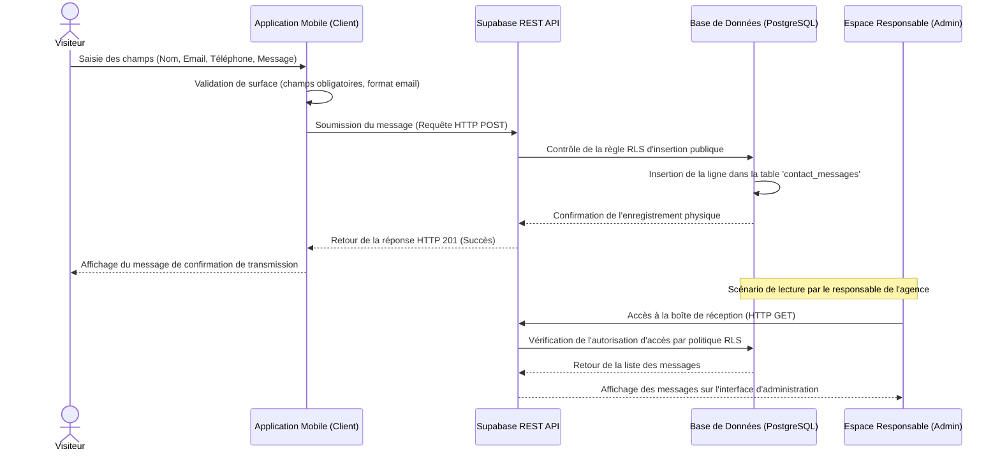

# CHAPITRE 3 : Conception de l'application

Ce chapitre présente la conception détaillée de l'application **Tasmim App**. Il expose les choix d'architecture, la modélisation des données à travers les modèles conceptuel et logique, les diagrammes de cas d'utilisation, de classes et de séquence (UML), ainsi que l'infrastructure technique qui relie l'application mobile aux services de Supabase et à la base de données PostgreSQL.

---

## 3.1 Introduction

La phase de conception constitue une étape fondamentale dans le cycle de vie du développement logiciel. Elle fait suite à l'analyse des besoins fonctionnels et non fonctionnels pour structurer la logique globale de la solution avant l'écriture du code. 

L'approche adoptée repose sur une modélisation rigoureuse. Cette dernière englobe la définition de l'architecture technique, la mise en œuvre de diagrammes UML (classes et séquences), la construction du modèle de données (MCD et MLD) et la spécification des règles de sécurité. L'ensemble de ces choix vise à garantir une application mobile réactive, évolutive et sécurisée.

---

## 3.2 Architecture technique de l'application

L'architecture technique de Tasmim App repose sur un paradigme de développement moderne dit « serverless » (sans serveur dédié à administrer). L'interaction directe s'effectue entre l'application cliente mobile, le fournisseur de services backend (Supabase) et la base de données relationnelle (PostgreSQL).



*Figure 9 : Schéma d'architecture technique générale*

### 3.2.1 Description des composants d'architecture

1. **Client mobile (Expo / React Native)** : Constitue le point d'interaction unique pour l'utilisateur final et le responsable de l'agence. Développée en TypeScript, l'application gère les états d'affichage, la navigation locale et le stockage des jetons de session de manière autonome.
2. **Supabase (Backend-as-a-Service)** : Remplace l'implémentation traditionnelle d'un serveur d'API (type Node.js ou Django). Supabase expose dynamiquement une API REST sécurisée par le protocole HTTPS et gère le module d'authentification des comptes utilisateurs (par courrier électronique ou via des tiers tels que Google et Facebook).
3. **Base de données PostgreSQL** : Assure le stockage physique persistant. Les requêtes en provenance du client mobile sont validées par la couche de sécurité de Supabase avant d'interroger ou de modifier les tables de données.

---

## 3.3 Diagramme de classes

Le diagramme de classes représente la structure statique du système en définissant les entités métiers, leurs attributs, leurs comportements et leurs associations mutuelles.



*Figure 10 : Diagramme de classes UML de l'application Tasmim App*

### 3.3.1 Description des relations et classes métiers

* **User et Profile** : Chaque utilisateur authentifié (`User`) est associé de manière unique à un profil public (`Profile`). Cette association de cardinalité (1-to-0..1) permet de découpler la gestion confidentielle des identifiants (gérée par Supabase) et les informations affichées à l'écran (nom complet, avatar).
* **ContactMessage** : Représente les messages saisis par les visiteurs de l'application. Cette entité est alimentée par le service `ContactService` lors de la soumission d'une demande de devis.
* **Services de communication (`AuthService`, `ContactService`, `AdminService`)** : Encapsulent les appels d'API vers le client Supabase (`SupabaseClient`). Ils séparent la logique métier des composants visuels afin de faciliter la maintenance de l'application.

---

## 3.4 Diagrammes de séquence

Les diagrammes de séquence documentent l'aspect dynamique du système en illustrant l'ordre chronologique des messages échangés entre les différents acteurs, l'interface utilisateur et les services du backend.

### 3.4.1 Processus d'authentification utilisateur

Le diagramme suivant présente le flux d'interactions lors d'une tentative de connexion, qu'elle soit effectuée par courrier électronique et mot de passe ou via un protocole d'authentification tiers (Google ou Facebook).



*Figure 11 : Diagramme de séquence du processus d'authentification*

### 3.4.2 Envoi d'un message depuis le formulaire de contact

Ce scénario décrit l'envoi d'une demande commerciale ou d'un devis par un visiteur de l'application, suivi de la réception et de la consultation du message par le responsable de l'agence.



*Figure 12 : Diagramme de séquence d'envoi d'un message de contact*

---

## 3.5 Modèles de Données (MCD, MLD et MPD)

La modélisation des données permet d'organiser rigoureusement les informations stockées au sein de l'application. Elle se décline en trois niveaux d'abstraction complémentaires.

### 3.5.1 Modèle Conceptuel de Données (MCD)

Le modèle conceptuel offre une vue sémantique des données, indépendamment des choix d'implémentation technique. Il met en relation les entités fondamentales :
* **AUTH_USERS** : Représente la table interne de gestion des comptes gérée par le module d'authentification de Supabase.
* **PROFILES** : Contient les informations relatives aux comptes (nom complet, avatar, fournisseur). Un utilisateur possède un et un seul profil.
* **CONTACT_MESSAGES** : Enregistre les requêtes de contacts émises via le formulaire de l'application mobile.

*(Note : Pour le schéma graphique du MCD, il convient de se référer à la Figure 13 du rapport papier).*

### 3.5.2 Modèle Logique de Données (MLD)

Le modèle logique traduit le MCD en structures relationnelles exploitables par un SGBD, en identifiant les clés primaires et les clés étrangères :

* **PROFILES** (<u>**id**</u> : UUID, email : Chaîne, auth_provider : Chaîne, provider_user_id : Chaîne [Null], full_name : Chaîne [Null], avatar_url : Chaîne [Null], created_at : Date/Heure)
  * *La clé primaire `id` est également une clé étrangère qui référence la table système d'authentification `auth.users(id)`.*
* **CONTACT_MESSAGES** (<u>**id**</u> : Entier, name : Chaîne, email : Chaîne, phone : Chaîne [Null], service_type : Chaîne, message : Texte, is_read : Booléen, created_at : Date/Heure, #user_id : UUID [Null], #read_by : UUID [Null])
  * *`user_id` est une clé étrangère optionnelle faisant référence à la table `auth.users(id)`.*
  * *`read_by` est une clé étrangère optionnelle faisant référence à la table `auth.users(id)`.*

---

## 3.6 Schéma de la base de données et Dictionnaire de données

L'implémentation concrète de la base de données PostgreSQL de Supabase est régie par un dictionnaire de données rigoureux.

### 3.6.1 Dictionnaire de données de la table `profiles`
Cette table stocke les détails des profils utilisateurs synchronisés avec le système d'authentification.

| Nom de colonne | Type physique | Propriétés | Description |
| :--- | :--- | :--- | :--- |
| **id** | UUID | PK, FK (`auth.users.id`) | Identifiant de l'utilisateur (lié à l'authentification) |
| **email** | VARCHAR | Unique, Nullable | Adresse email de l'utilisateur |
| **auth_provider** | VARCHAR | Not Null (Défaut: 'email') | Type de fournisseur d'accès ('email', 'google', 'facebook', 'unknown') |
| **provider_user_id**| VARCHAR | Nullable | Identifiant fourni par le service tiers (ex. Google/Facebook) |
| **full_name** | VARCHAR | Nullable | Nom complet de l'utilisateur |
| **avatar_url** | VARCHAR | Nullable | Adresse de l'image de profil de l'utilisateur |
| **created_at** | TIMESTAMPTZ | Not Null (Défaut: `now()`) | Date d'inscription |

### 3.6.2 Dictionnaire de données de la table `contact_messages`
Cette table stocke les messages soumis par le biais du formulaire de contact de l'application mobile.

| Nom de colonne | Type physique | Propriétés | Description |
| :--- | :--- | :--- | :--- |
| **id** | BIGINT | PK, Auto-incrémenté | Identifiant unique de la demande de contact |
| **name** | VARCHAR | Not Null | Nom ou pseudonyme du visiteur |
| **email** | VARCHAR | Not Null | Adresse de messagerie électronique du visiteur |
| **phone** | VARCHAR | Nullable | Numéro de téléphone du visiteur |
| **service_type** | VARCHAR | Not Null | Nature du service demandé |
| **message** | TEXT | Not Null | Contenu de la requête formulée |
| **is_read** | BOOLEAN | Not Null (Défaut: `false`) | Indicateur de statut de lecture par le responsable |
| **created_at** | TIMESTAMPTZ | Not Null (Défaut: `now()`) | Date et heure de soumission du formulaire |

---

## 3.7 Sécurité et Intégrité des Données

La sécurité des données est au cœur de l'application mobile. Étant donné que le client mobile communique directement avec la base de données via les APIs de Supabase sans passer par une API intermédiaire classique, deux technologies fondamentales de PostgreSQL ont été mises en œuvre pour garantir l'intégrité et la confidentialité des échanges :

### 3.7.1 Automatisation par déclencheur SQL (Trigger)
Afin d'éviter tout traitement manuel des profils et toute incohérence lors des inscriptions, un mécanisme de déclencheur (**Trigger**) a été programmé. À chaque fois qu'un utilisateur crée un compte dans le système d'authentification (`auth.users`), une procédure stockée SQL s'exécute automatiquement en tâche de fond pour répercuter les informations (nom complet, email, fournisseur, image de profil) dans la table publique `profiles` :

```sql
create or replace function public.handle_new_user()
returns trigger
language plpgsql
security definer
set search_path = public
as $$
begin
  insert into public.profiles (
    id, email, auth_provider, provider_user_id, full_name, avatar_url
  )
  values (
    new.id,
    nullif(new.email, ''),
    coalesce(new.raw_app_meta_data->>'provider', 'email'),
    coalesce(new.raw_user_meta_data->>'provider_id', new.raw_user_meta_data->>'sub'),
    coalesce(new.raw_user_meta_data->>'full_name', new.raw_user_meta_data->>'name'),
    new.raw_user_meta_data->>'avatar_url'
  )
  on conflict (id) do update set
    email = coalesce(excluded.email, public.profiles.email),
    auth_provider = coalesce(excluded.auth_provider, public.profiles.auth_provider),
    full_name = coalesce(excluded.full_name, public.profiles.full_name);
  return new;
end;
$$;
```

### 3.7.2 Contrôle d'accès au niveau des lignes (Row Level Security - RLS)
L'implémentation de la politique de sécurité **Row Level Security (RLS)** permet de restreindre l'accès aux enregistrements en fonction des privilèges de l'utilisateur connecté.

1. **Isolation des profils** : Il est interdit à un utilisateur de lire ou de modifier le profil d'un tiers. L'accès est strictement borné à l'identifiant de l'utilisateur actif via la politique PostgreSQL :
   ```sql
   create policy "les utilisateurs lisent leur propre profil"
   on public.profiles for select to authenticated
   using (auth.uid() = id);
   ```
2. **Gestion des messages de contact** :
   * **Insertion** : La soumission d'une demande de devis doit être accessible à tous, y compris aux visiteurs anonymes. L'autorisation d'insertion publique a été configurée à cet effet.
   * **Lecture et Administration** : Seul le responsable de l'agence (identifié par l'adresse de courrier électronique `najileila308@gmail.com`) possède le droit d'afficher la liste des messages, de marquer un message comme lu ou de procéder à sa suppression définitive. Cette restriction est appliquée par la politique suivante :
     ```sql
     create policy "seul l'email admin lit les messages"
     on public.contact_messages for select to authenticated
     using (auth.email() = 'najileila308@gmail.com');
     ```

---

## 3.8 Maquettes Figma et Interface utilisateur

En amont de la phase d'implémentation technique sous Expo/React Native, une étape de prototypage d'interface utilisateur (UI/UX) a été menée sur l'outil de conception graphique **Figma**.

L'élaboration des maquettes a permis de définir une charte graphique cohérente, caractérisée par :
* Un jeu de couleurs premium combinant des tonalités sombres de bleu nuit (`#071A3D` et `#0E2C66`) et des accents lumineux (`#1967DE` et `#4CA3FF`) afin de renvoyer une image professionnelle propre aux agences digitales.
* Une typographie claire, moderne et adaptée aux contraintes d'affichage mobile.
* Un système de composants réutilisables (boutons d'action, champs de saisie, cartes de présentation des projets et services) garantissant une cohérence visuelle sur l'ensemble des écrans.
* Une navigation par onglets (Bottom Tab Navigation) optimisant le parcours utilisateur lors de la transition entre la page d'accueil, la liste des projets, la boîte de contact et l'espace d'administration.

Ce travail préliminaire sur Figma a servi de référence directe lors du codage des vues avec le framework React Native, minimisant les ajustements graphiques lors de la phase d'intégration logicielle.

---

## 3.9 Conclusion du chapitre

Ce chapitre de conception a permis d'établir la feuille de route technique de l'application **Tasmim App**. À l'aide de l'architecture technique, des diagrammes UML et de la modélisation relationnelle de la base de données, la structure globale de l'application a été définie avec précision. L'accent mis sur l'intégrité (déclencheurs PostgreSQL) et la sécurité d'accès (politiques RLS de Supabase) assure une infrastructure robuste et imperméable aux tentatives d'accès non autorisés. 

Ces bases théoriques et techniques étant posées, la phase d'implémentation, détaillée dans le chapitre suivant, peut être abordée de manière structurée et organisée.
