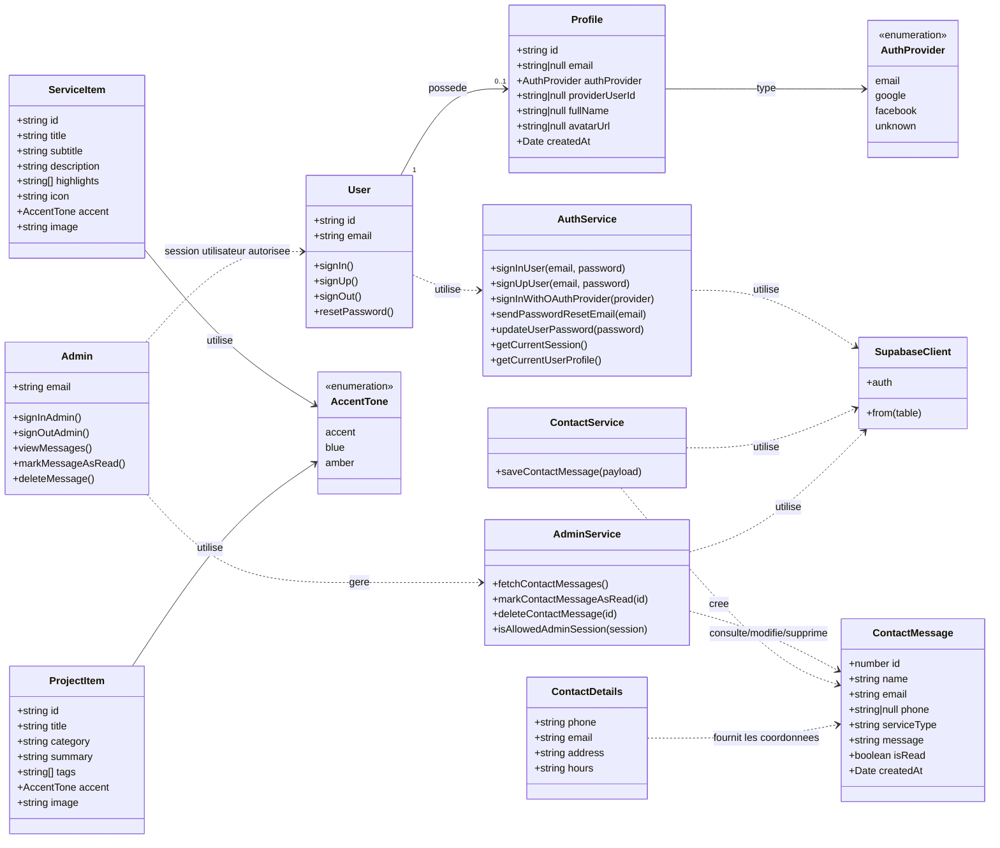

# Diagramme de classes - TasmimApp

Ce diagramme represente les principales classes metier de l'application TasmimApp : authentification, profil utilisateur, messages de contact, espace administrateur, services et projets affiches dans l'application.

## Description courte

- `User` represente l'utilisateur authentifie via email, Google ou Facebook.
- `Profile` stocke les informations complementaires de l'utilisateur dans Supabase.
- `Admin` represente le responsable autorise par email a consulter et gerer les messages.
- `ContactMessage` represente les messages envoyes depuis le formulaire de contact.
- `ServiceItem` et `ProjectItem` representent les services et projets affiches dans l'application.
- `AuthService`, `ContactService` et `AdminService` regroupent les operations principales avec Supabase.
